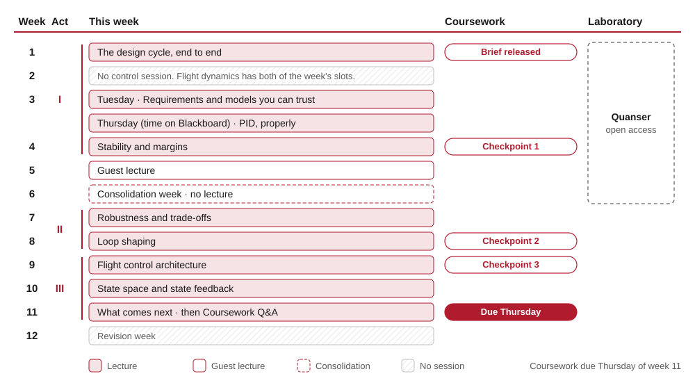

# How this unit runs

This page is the shape of the unit in one place: the weeks, what you are
expected to put into one, how the coursework builds, and when the laboratory
is open. It is written in **week numbers**, because those are a property of the
unit. Dates, rooms and deadlines live on Blackboard, which is the version to
trust when the two disagree.

## The term at a glance

Eleven weeks of content in 3 acts, then revision.

**There is no control session in week 2.** Flight dynamics has both of the week's slots. **Week 3 runs twice**, on the Tuesday and Thursday. Blackboard carries the room and the hour for the Thursday of week 3.

{ width="100%" }

The same thing as a table, if you would rather read it or follow a link:

| Week | | What it covers |
|---|---|---|
| **1** | Act 1 | [The design cycle, end to end](w01-design-cycle/index.md) |
| **2** | Act 1 | [Requirements and models you can trust](w02-requirements-and-models/index.md) |
| **3** | Act 1 | [PID, properly](w03-pid-control/index.md) |
| **4** | Act 1 | [Stability and margins](w04-stability-margins/index.md) |
| **5** |  | *Guest lecture* |
| **6** |  | *Consolidation week. No lecture: time to catch up, use the laboratory, and act on feedback.* |
| **7** | Act 2 | [Robustness and trade-offs](w07-robustness/index.md) |
| **8** | Act 2 | [Loop shaping](w08-loop-shaping/index.md) |
| **9** | Act 3 | [Flight control architecture](w09-flight-control-architecture/index.md) |
| **10** | Act 3 | [State space and state feedback](w10-state-space/index.md) |
| **11** | Act 3 | [What comes next](w11-beyond-this-course/index.md) |
| **12** | | *Revision week. Nothing new.* |

## What you are expected to invest

**About 6 hours in a lecture week**, including the lecture itself:

- **2 h** in the room with us;
- **2 h** independent: closing the loop on the last session, the example sheet, and a look ahead at the next case;
- **2 h** on the coursework, which is designed to be done a little each week rather than in a block at the end.

Plus **4 hours of laboratory** in total, across the open window below.

{ width="100%" }

!!! info "Why that adds up to less than the credit says"
    Ten credits is 100 notional hours. What is planned above comes to
    roughly **70 hours** across the term,
    and the gap is deliberate rather than an accounting error.

    Two reasons. Some of it is slack: a week where the example sheet takes
    longer than it should, or the coursework needs a second attempt, and a
    plan with no slack in it is a plan that fails in week 5. The rest is
    **room to go further**, which is what the remaining time is actually for.
    Dorf and Bishop's worked examples, the reading list on Blackboard, and
    the video series on it are all there for people who want to push past
    what the handouts cover. See [Recommended reading](reading.md).

    A 35-hour working week across 3 units at once is the
    assumption behind all of it. If a week is taking far more than this,
    that is worth telling us about rather than absorbing.

## How the coursework builds

One brief, released in week 1 and due in week 11, on the Thursday. It is designed to be built a piece
at a time, and the checkpoints exist so that you find out whether you are on
track while there is still time to do something about it.

| Week | What the coursework asks of you |
|---|---|
| 1 | **Brief released.** Read the brief; get your variant from cade30008.inputs; first decision-log entry |
| 2 | Explore your aircraft variant and the flight-test tool |
| 3 | Draft section 1, requirements, and section 2, model validation |
| 4 | **Checkpoint 1.** Finish sections 1 and 2; submit checkpoint 1 by the end of the week |
| 5 | Act on checkpoint 1's automated feedback |
| 6 | Consolidation week: act on checkpoint 1's feedback and start the design; if behind, catch up here or across weeks 7 to 9 |
| 7 | Stability analysis of your first design; draft section 4 |
| 8 | **Checkpoint 2.** Robustness and the designed controller; sections 3 and 4; submit checkpoint 2, then peer review |
| 9 | **Checkpoint 3.** Verification and the whole draft paper; submit checkpoint 3 |
| 10 | Act on checkpoint 3's feedback. Optional: a state-feedback design, for credit under criterion B2 |
| 11 | **Deadline.** Final checks with cade30008.validate_submission; submit by Thursday |

## The laboratory

**Open access across weeks 1 to 6**, self-scheduled, about 4 hours in total.

You work at the rig in **pairs or threes**, and **one of you books for
the group** rather than everybody booking separately: the window would fill
three times over otherwise.

There is no timetabled slot, so book a slot through the form on Blackboard,
and treat that as something to do in the first week rather than the first
time you need the rig.

The window closes at the end of the consolidation week, not at the end of
term, which is the part people miss: by the time the coursework gets
difficult, the laboratory has shut. Slots also fill from the back, so the
people who book late get the worst of both.

