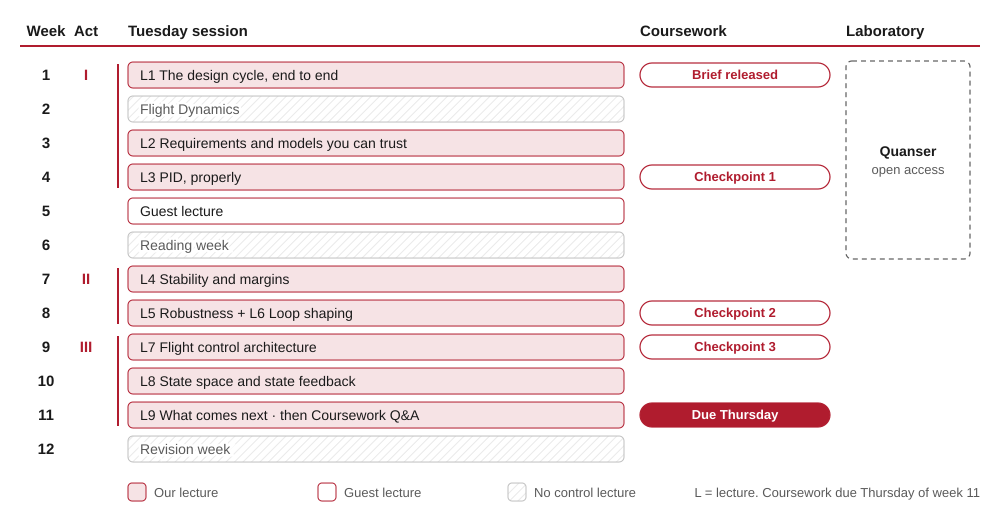

# Lecture 1: The design cycle, end to end

[Slides](../slides/l01-design-cycle/index.html)
[Example sheet](example-sheet.md)
[Solutions](solutions.md)

!!! warning "Not yet written"
    This lecture is scoped but not written. Its title, learning outcomes and
    place in the unit are set; the sections below are placeholders, there so
    that the navigation, the slide deck and the example sheet exist in their
    final shape.

One paragraph saying what this lecture does, and how it follows from the last one.

<!-- outcomes:start -->
!!! abstract "Learning outcomes"
    By the end of this lecture you should be able to:

    - describe the control design cycle, and say where in it a given design activity sits;
    - identify a second-order model from a measured response, by reading its damping ratio, natural frequency and gain;
    - tune a PID controller in simulation to meet a stated requirement;
    - explain why a design that meets its requirement in simulation may not meet it on hardware.
<!-- outcomes:end -->

## Where we are {#recap}

What the student already knows that this lecture builds on, and where it came from.

## First idea {#idea-one}

The first main idea, developed from what the recap established.

## Second idea {#idea-two}

The second main idea, and how it changes the picture.

## Worked example {#worked-example}

A worked example carrying the ideas above through to numbers. Numbers belong in
a script under `models/`, not typed in here.

## Summary {#summary}

The few things to take away.

## How the unit runs {#schedule}

Nine lectures, in three acts, alongside a coursework that builds through the
term and an open-access laboratory. Lectures are on Tuesdays. The schedule
below is this year's: lectures keep their numbers from year to year, but the
weeks they fall in can change.

<figure markdown="span">
  { width="100%" }
</figure>

<!-- schedule:start -->
*2026/27. Lectures are on Tuesdays.*

| Week | Tuesday session | Coursework |
|---|---|---|
| 1 | [Lecture 1: The design cycle, end to end](../l01-design-cycle/index.md) | Brief released |
| 2 | *Flight Dynamics* |  |
| 3 | [Lecture 2: Requirements and models you can trust](../l02-requirements-and-models/index.md) |  |
| 4 | [Lecture 3: PID, properly](../l03-pid-control/index.md) | Checkpoint 1 |
| 5 | *Guest lecture* |  |
| 6 | *Reading week* |  |
| 7 | [Lecture 4: Stability and margins](../l04-stability-margins/index.md) |  |
| 8 | [Lecture 5: Robustness and trade-offs](../l05-robustness/index.md) and [Lecture 6: Loop shaping](../l06-loop-shaping/index.md) | Checkpoint 2 |
| 9 | [Lecture 7: Flight control architecture](../l07-flight-control-architecture/index.md) | Checkpoint 3 |
| 10 | [Lecture 8: State space and state feedback](../l08-state-space/index.md) |  |
| 11 | [Lecture 9: What comes next](../l09-beyond-this-course/index.md); then coursework Q&A | **Due Thursday of week 11** |
| 12 | *Revision week* |  |

The Quanser laboratory is open access from week 1 to week 6: you choose when to go.
<!-- schedule:end -->

## Your week {#workload}

This half of the unit is planned around a steady week, not a heroic one.

<!-- workload:start -->
| In a week with a lecture | Hours |
|---|---|
| The lecture, on Tuesday | 2 |
| Independent learning: go back over the handout and do the week's challenge (45 min), work the example sheet (1 h), and look at next week's case (15 min) | 2 |
| Coursework | 2 |
| **Total** | **6** |

On top of that, **4 hours in the Quanser laboratory**, at times you choose between week 1 and week 6. In weeks 2 and 6 there is no control lecture, so just the coursework's 2 hours. Coursework runs to week 11. Over the term that comes to about 62 hours: 18 in lectures, 18 of independent learning, 22 of coursework and 4 in the laboratory.
<!-- workload:end -->

**Do the coursework in the week, not at the end.** The coursework is set up to
build week by week alongside the lectures: each week's step uses what that
week's lecture has just covered, while it's fresh, and the checkpoints give you
feedback while it can still change your design. Many students leave coursework
until the last few weeks of term. It is possible, but it means learning the
material twice — once in the lecture, and again, alone, under deadline
pressure — and it throws away the feedback. Two hours a week, starting in week
1, is the plan that works.

## AI in this course {#ai}

Two ideas shape how I think about generative AI, and large language models in
particular.

**AI rewards expertise.** Language models make everyone a passable generalist,
which hides the fact that experts get far more out of them. Knowing the subject
is what lets you ask the precise question, notice the flaw in the answer, and
refuse a confident wrong turn. So the fundamentals in this unit are what will
make you good with AI in control engineering, not what AI makes unnecessary.

**Work, or gym?** Before using AI for a task, ask whether only the result
matters — that is work, and AI is a sensible tool for it — or whether doing it
is the point, because doing it is what builds your ability. That is the gym,
and using AI there defeats the purpose. Most of what you do at university is the
gym, even when it looks like work.

In this unit you may use AI in the ways the coursework brief sets out; you will
not need to; and you are responsible for everything you submit, including
anything a tool produced. I used AI to help create these materials, but the
pedagogy and content are mine, and I have checked and rewritten all of it.

More on all of this, and how to send me feedback, is on
[AI in this course](../ai.md).

## Further reading {#further-reading .no-slides}

Textbook chapters and papers. This section is handout-only, which is what
`.no-slides` marks.
