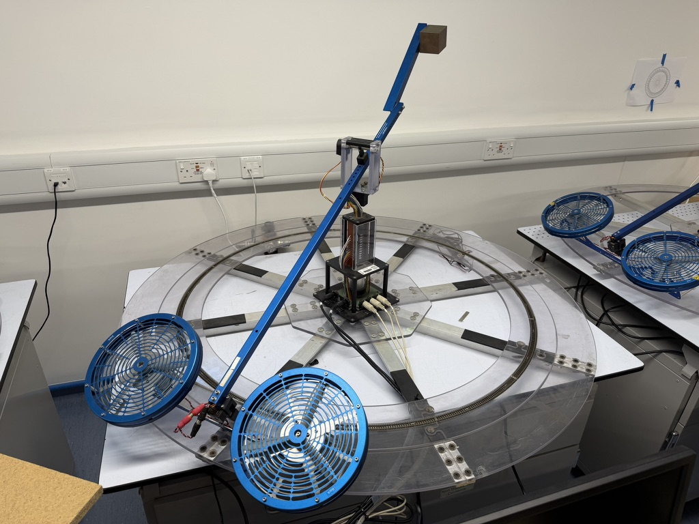

# The Quanser laboratory

[Part 1: identify](part1-identify.md)
[Part 2: design](part2-design.md)
[Part 3: validate](part3-validate.md)

The laboratory runs one experiment in three parts, and the parts are
deliberately not all meant to be undertaken in the same room on the same
afternoon.

| Part | Where | Roughly |
|---|---|---|
| **1. Identify** | At the rig | One 2-hour session |
| **2. Design** | Anywhere | Your own time, between sessions |
| **3. Validate** | At the rig | One 2-hour session |

You measure the machine, you go away and design something against what you
measured, and then you come back and find out what the measurement left out.
That shape is the point. A laboratory where you design and test in the same
hour teaches you to tune until it looks right, which is a different skill and
a less useful one.

## Booking

Sessions are booked through the form linked on Blackboard. **You work in pairs or
threes, and one of you books for the group.**

Book early rather than late. The window closes before the coursework gets
hard, and the last week is always the busy one.

## Before you go

- [ ] Read [Part 1](part1-identify.md) all the way through. It is short, and
      the rig is not the place to read it.
- [ ] Bring a laptop if you have one. The bench machines work, but your own
      MATLAB means you can carry on afterwards.
- [ ] Download the [laboratory software](https://drive.mathworks.com/sharing/ad3e3e94-cfda-486b-ad94-d8c0d52afbc0/lab-quanser) from MATLAB Drive into a folder you can find. The [code page](code/index.md) says what each file is for.
- [ ] Agree with your group who is driving and who is writing things down.
      Swap half way.

!!! warning "Check the version before each session"
    All of this is **new for 2026/27**, and it will be corrected and improved
    during the year, mostly because of things you tell me. So the files change.

    Before each laboratory session, compare the version below with the one at
    the top of the Drive folder's own README. If they differ, download the
    folder again.

    **Your recordings do not go stale.** The scripts may change; data you
    measured will still load and still fit under a later version, because the
    format is the one the rig's own `s_save` writes.

<!-- drive-version:start -->
**[Download the laboratory files](https://drive.mathworks.com/sharing/ad3e3e94-cfda-486b-ad94-d8c0d52afbc0/lab-quanser)** from MATLAB Drive, or [everything for the unit](https://drive.mathworks.com/sharing/ad3e3e94-cfda-486b-ad94-d8c0d52afbc0).

*Version 2026.9, 2026-09-22. If this differs from the version in the folder's own README, download it again.*
<!-- drive-version:end -->

## Safety briefing

!!! danger "The amplifier switch is how you stop the rig"
    The rocker switch on the amplifier is the emergency stop. **There is no
    separate stop button and no software interlock.** Before you power
    anything, find that switch and make sure whoever is not driving can reach
    it.

    If the rig does something you do not like, switch the amplifier off. Do not try to fix it in software while it is
    moving.

!!! warning "Low-flying aircraft"
    Beyond that: keep fingers and hair away from the rotors, do not lean over the arm's travel, and although the rotors are guarded do watch your fingers.

!!! tip "Take care, be mindful of others"
    Bear in mind others will be relying on the equipment, and sharing the lab, so please try to keep it in working order and tidy. Catch the body of the Quanser if you can to avoid bumpy landings. The lab is run by technical services: if anything isn't working, email **engf-tech-hub@bristol.ac.uk** and copy me in. Put the course code in the subject, and say which station you were on and what the problem was.

## What you are building towards

The three parts run twice, at two levels. Do the first before the second.

**One axis.** Elevation alone, with the other two held still. A second-order
plant, a PID controller, and a requirement you can check. Everything in the
first session's lecture applies directly.

**Three axes.** The whole machine: elevation, pitch and travel, two motors,
and the coupling between them. First as three PID loops, which is what many
real vehicles fly with and which will show you why decoupling is a design
decision rather than an approximation. Then as a state-space design against
the model the manufacturer supplies, which is where the second half of the
unit is heading.

Most groups get one axis working comfortably in their two sessions, three axes can be considered an extension.

## The rig

<figure markdown="span">
  { width="100%" }
</figure>

Three angles, two motors.

| Axis | Symbol | Positive when |
|---|---|---|
| Elevation | \( \varepsilon \) | the body is above horizontal; zero when level |
| Pitch | \( \rho \) | the front motor is higher than the back motor |
| Travel | \( \lambda \) | the body rotates counter-clockwise, seen from above. It turns continuously, and wraps back to zero at 360 degrees |

You (usually via a control system running in Simulink) command two rotor voltages. Elevation is affected by their sum and pitch by
their difference. **Travel is not commanded at all**: it happens because pitch
tilts the thrust sideways and the machine rotates round the track after it.
This is referred to as _coupling_ of degrees of freedom, and it is why three axes is harder than three times one
axis.

Each rotor is driven about an operating voltage of roughly 7.5 V, which is
what holds the arm up. Your controller's output is added to that, so what you
have to play with is the headroom between there and the amplifier's limit.

## Research-grade aerospace machinery

Notice the model railway track embedded in the ring around the base of one Quanser? This machine was used a while back to model aerial/ground vehicle collaborative control.

A model train ran around the track, linked into the control system for forward and reverse speed. A camera attached to the Quanser spotted a marker on the train, and the two worked together to maintain relative position. This early work built into landing a petrol-powered remote-control helicopter on the roof of a moving Rover 400 on an abandoned Cornish airfield - revolutionary at the time.

*Jones and Richardson. I'll add the reference as soon as I find a publicly-accessible version.*
