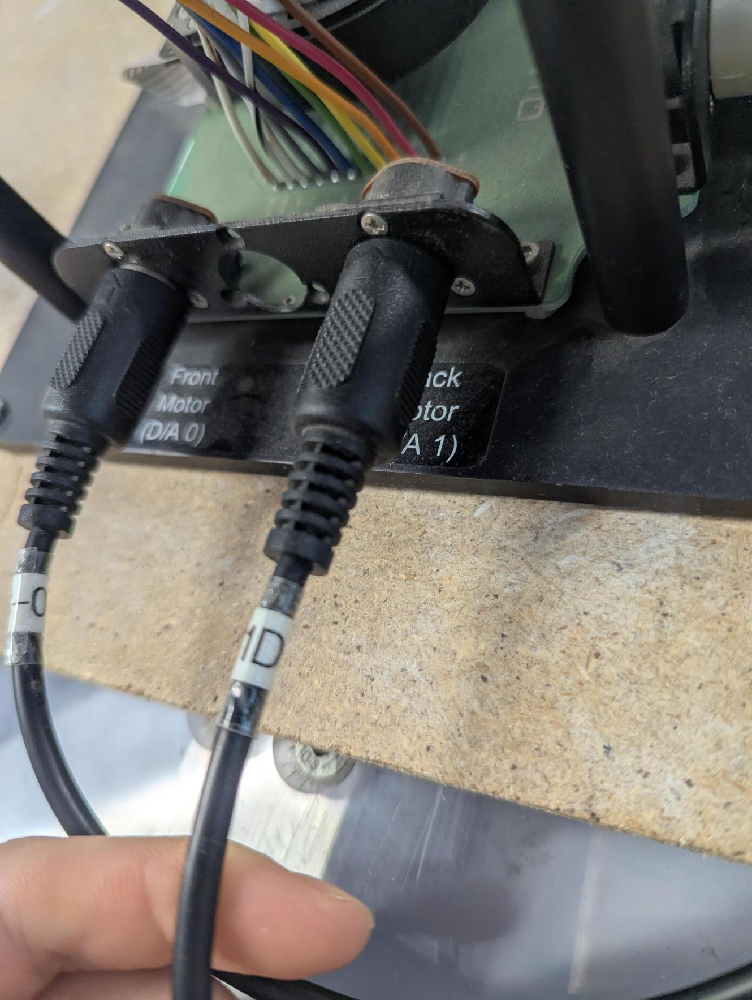
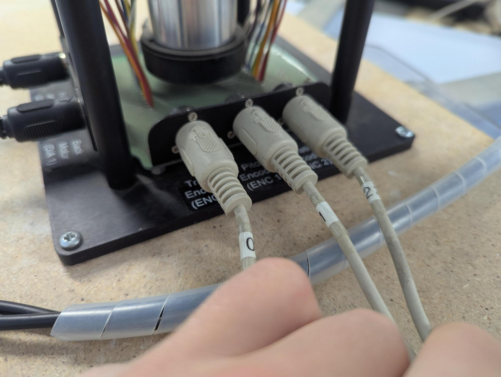
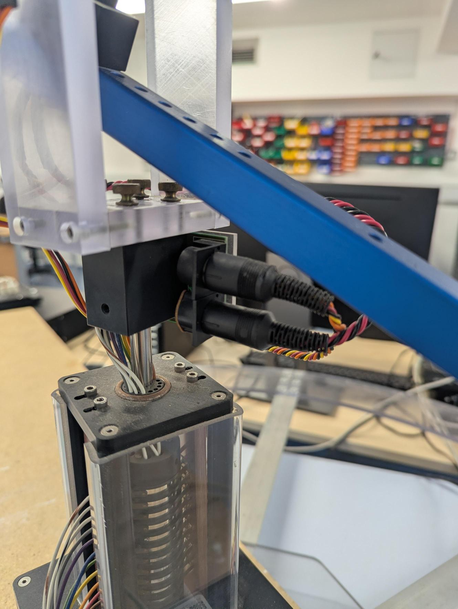
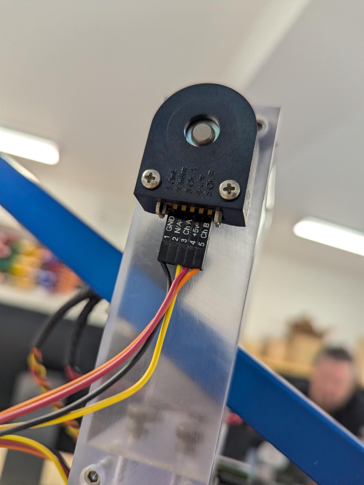
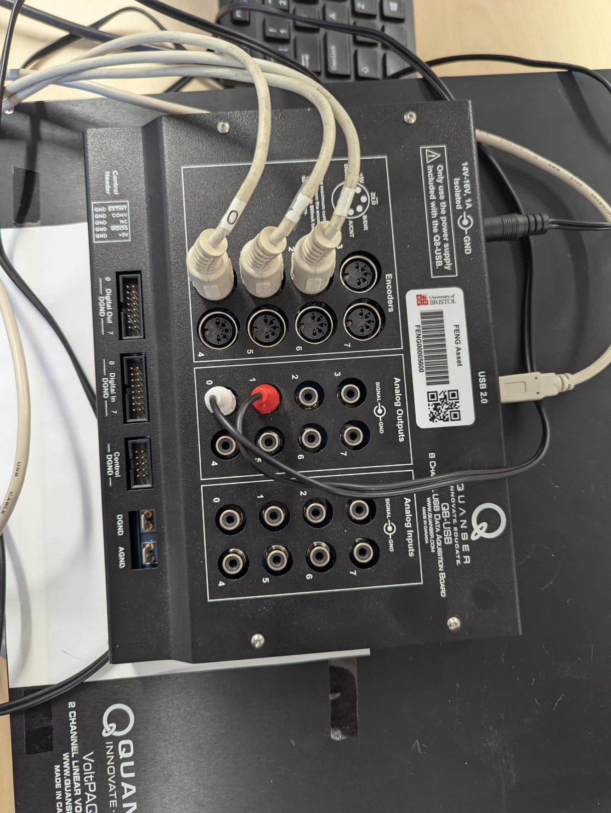
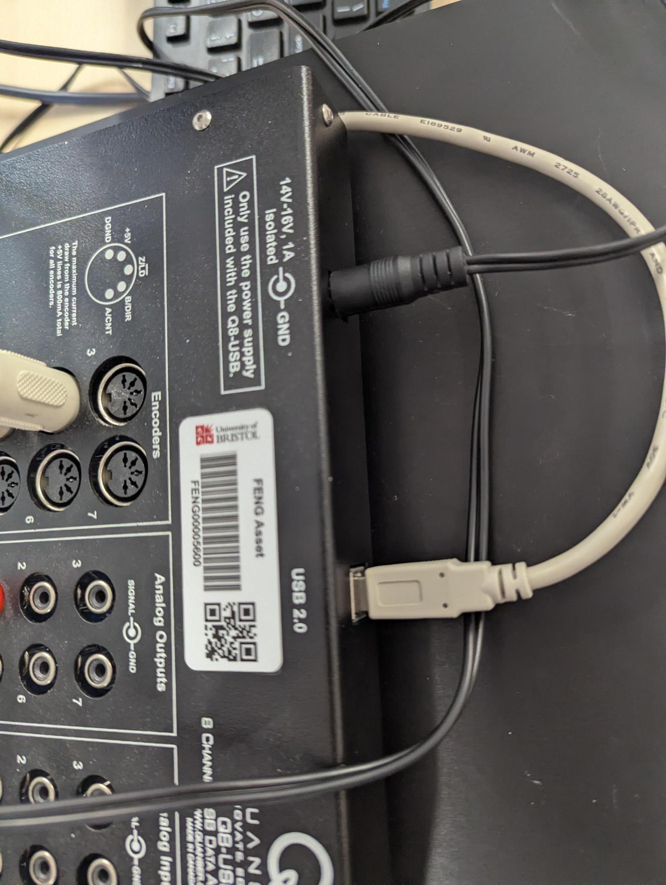
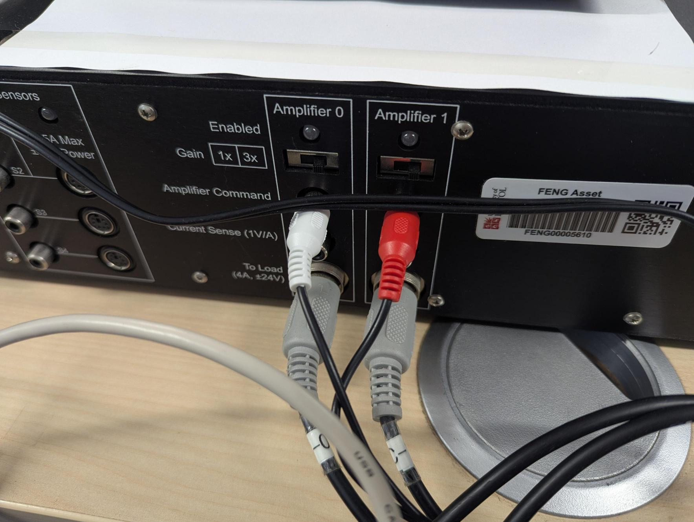

# How the rig is wired

Part of the [staff area](index.md). Taken on 22 September 2026, so this is the
laboratory as it stands rather than as the manual describes it.

The point of this page is the five minutes at the start of an open-access
session when something is not working and nobody can remember which cable goes
where.

## The signal path, in one line

```
MATLAB  ->  Q8-USB  ->  VoltPAQ amplifier  ->  motors
                <-  encoders  <-  slip ring  <-  arm
```

Two analog outputs drive two amplifier channels; three encoders come back in.
Everything from the arm reaches the base through the slip ring in the column,
which is what lets travel turn without limit.

## The motors

<figure markdown="span">
  { width="100%" }
</figure>

| Socket | Drives | From |
|---|---|---|
| **Front Motor (D/A 0)** | the front rotor | VoltPAQ Amplifier 0 |
| **Back Motor (D/A 1)** | the back rotor | VoltPAQ Amplifier 1 |

The numbering is the thing to get right. **Elevation is the sum of the two and
pitch is the difference**, so swapping them leaves elevation working and
inverts pitch, which looks like a tuning problem and is not one.

## The encoders

<figure markdown="span">
  { width="100%" }
</figure>

| Socket | Measures |
|---|---|
| **ENC 0** | travel |
| **ENC 1** | pitch |
| **ENC 2** | elevation |

The cables are numbered to match, so a cable marked 2 belongs in ENC 2.

### Through the column

<figure markdown="span">
  { width="100%" }
</figure>

The pitch and elevation encoders sit on the moving part of the machine, so
their wiring comes down the column through the slip ring. That is what lets
travel rotate continuously instead of winding a loom up until something gives.

### At the encoder itself

<figure markdown="span">
  { width="100%" }
</figure>

Five pins: **1 Gnd, 2 Index, 3 Ch A, 4 +5 V, 5 Ch B**. The mating connector is
labelled the same way, and the index line is not used.

Worth knowing rather than acting on: a connector seated one pin out puts +5 V
somewhere it should not be. If an axis reads nothing, look at the seating
before looking at the software.

## The Q8-USB board

<figure markdown="span">
  { width="100%" }
</figure>

| On the board | Carries |
|---|---|
| **Encoders 0, 1, 2** | travel, pitch, elevation |
| **Analog Output 0**, white | command to Amplifier 0, the front motor |
| **Analog Output 1**, red | command to Amplifier 1, the back motor |
| **USB** | everything, to the bench computer |

**White is 0 and red is 1**, the whole way through: analog output, amplifier
command, amplifier channel. Keeping to that is how you tell at a glance
whether anything has been swapped.

<figure markdown="span">
  { width="100%" }
</figure>

The board takes its own 14–16 V supply as well as USB. Both must be in: on USB
alone it enumerates and reads nothing, which looks like a broken encoder.

## The VoltPAQ amplifier

<figure markdown="span">
  { width="100%" }
</figure>

| On the amplifier | Goes to |
|---|---|
| **Amplifier Command 0**, white | from Q8-USB Analog Output 0 |
| **Amplifier Command 1**, red | from Q8-USB Analog Output 1 |
| **To Load 0** | Front Motor (D/A 0) |
| **To Load 1** | Back Motor (D/A 1) |

Each channel is rated **4 A at ±24 V**, which is the 24 V the flight envelope
works its head-room against.

!!! danger "Both gain switches must be on 3x, and in this photograph they do not look the same"
    Each channel has a **Gain** switch marked **1x** and **3x**. The model
    assumes **3x**: it divides the controller's demand by three before the
    board, in the block called *cable gain pre-compensation*, so the
    amplifier's own gain of three puts it back.

    In the photograph above, **the two switches are not obviously in the same
    position** — Amplifier 1 shows a red marking that Amplifier 0 does not.
    Check them both by eye at the bench, because a photograph taken at an
    angle is not evidence.

    If one is on 1x, that motor receives a third of the voltage the other
    does. Elevation still works, because it is the sum and simply comes out
    weaker. **Pitch is the difference, so it ends up with a standing offset**,
    and the machine drifts round the track with no input. That reads as a
    faulty rig or a bad controller. It is a switch.

!!! warning "The amplifier switch is the emergency stop"
    There is no separate stop button and no software interlock. If the rig
    does something you do not like, switch the amplifier off.

## When something is not working

In this order, because it goes from likeliest to least:

1. **Is the amplifier on, and are both Enabled lights lit?**
2. **Both gain switches on 3x?** See above.
3. **Q8-USB power in as well as USB?** USB alone gives no readings.
4. **Encoder cables in the sockets their numbers match?** 0 travel, 1 pitch,
   2 elevation.
5. **White to 0, red to 1**, at both ends.
6. Only then start looking at the model.

If it is the hardware rather than the wiring, technical services run the
laboratory: **engf-tech-hub@bristol.ac.uk**, with the course code in the
subject and the station you were on.
