# Week 3: PID, properly

<div class="lesson-links" markdown>
[Slides](../slides/w03-pid-control/index.html)
[Example sheet](example-sheet.md)
[Solutions](solutions.md)
</div>

This lecture builds a pitch-attitude controller for a small fixed-wing UAV, one term at a time. Each term of a PID controller is introduced for what it does to the loop's Bode plot, and then for what that means for the step response. You already know both views from year 2. The aim is to use them together, so that you can design a controller rather than tune one by trial and error.

!!! abstract "Learning outcomes"
    By the end of this week you should be able to:

    - explain what the proportional, integral and derivative terms each do to a loop's Bode plot and to its step response;
    - predict steady-state errors from the system type, for both reference changes and disturbances;
    - estimate overshoot and speed from phase margin and crossover frequency;
    - design a PID controller to meet a crossover frequency and phase margin;
    - recognise derivative kick and integrator windup, and apply the standard fixes.

## Where we are {#recap}

<figure markdown="span">
  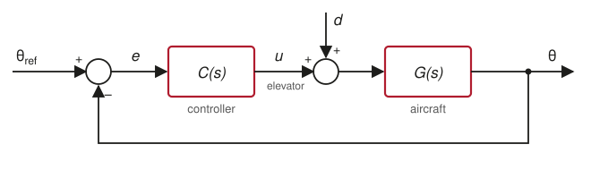{ width="640" }
  <figcaption>The loop studied throughout. The disturbance d enters at the plant input, alongside the elevator command.</figcaption>
</figure>

A controller \(C(s)\) acts on the error \(e = \theta_{ref} - \theta\), and the plant \(G(s)\) turns the elevator command \(u\) into pitch attitude \(\theta\). A disturbance \(d\) adds to the elevator command. It stands for anything that pitches the aircraft without the controller asking, such as a trim change after a centre-of-gravity shift. Everything about the closed loop follows from the **loop gain**

$$
L(s) = C(s)\,G(s),
$$

because

$$
\theta(s) = \underbrace{\frac{L(s)}{1 + L(s)}}_{T(s)}\,\theta_{ref}(s) \;+\; \underbrace{\frac{G(s)}{1 + L(s)}}_{\text{disturbance path}}\,d(s).
$$

Read these on a Bode plot of \(L\):

- **Where \(|L| \gg 1\)**, \(T \approx 1\), so the attitude follows the reference. The disturbance path is about \(1/C\), so disturbances are suppressed by the controller gain.
- **Where \(|L| \ll 1\)**, \(T \approx L\), so the loop hardly responds. Feedback has stopped acting.
- **The crossover frequency \(\omega_c\)**, where \(|L(j\omega_c)| = 1\), separates the two. It sets how fast the closed loop is.
- **The phase margin**, \(PM = 180^\circ + \angle L(j\omega_c)\), sets how gracefully the loop hands over at crossover. It determines the damping and the overshoot.

Designing a controller means shaping \(L(j\omega)\): enough gain at low frequency, a crossover where you want it, and enough phase margin when you get there.

## The pitch-attitude loop {#pitch-loop}

We control the pitch attitude of a small fixed-wing UAV with its elevator. Three effects are chained together:

| Effect | Transfer function | Meaning |
|---|---|---|
| Pitch-rate response | \(\dfrac{q}{\delta_e} = \dfrac{2}{0.5s + 1}\) | 1 rad of elevator gives 2 rad/s of pitch rate, with a 0.5 s time constant |
| Elevator servo | \(\dfrac{1}{0.1s + 1}\) | The servo lags its command by about 0.1 s |
| Attitude | \(\dfrac{\theta}{q} = \dfrac{1}{s}\) | Attitude is the integral of pitch rate |

Multiplying them out gives the plant

$$
G(s) = \frac{\theta(s)}{\delta_e(s)} = \frac{40}{s(s + 2)(s + 10)}.
$$

The elevator can travel \(\pm 20^\circ\). The pitch-rate model lumps the short-period mode into a single time constant. Later lectures replace it with the full short-period approximation, but the design approach here carries over unchanged.

<figure markdown="span">
  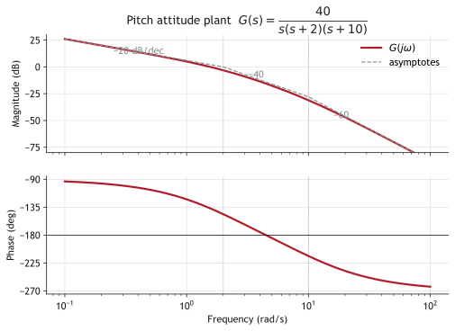
  <figcaption>The plant alone. The integrator contributes −90° everywhere, and each lag takes a further 90° above its corner frequency.</figcaption>
</figure>

Note two features for later. The plant already contains an integrator, so it is **type 1**. Its phase passes −180° at a finite frequency, so a large enough gain will make the loop unstable.

## Proportional control {#proportional}

With \(C(s) = K_p\), the loop is \(L = K_pG\). Changing \(K_p\) slides the magnitude plot up or down and leaves the phase plot alone. That single fact explains everything proportional control can and cannot do.

**Gain margin.** The phase reaches −180° where \(\tan^{-1}(\omega/2) + \tan^{-1}(\omega/10) = 90^\circ\). That happens where \((\omega/2)(\omega/10) = 1\), so \(\omega_{180} = \sqrt{20} = 4.47\) rad/s. There

$$
|G(j\omega_{180})| = \frac{40}{\sqrt{20}\,\sqrt{24}\,\sqrt{120}} = \frac{40}{240} = \frac{1}{6},
$$

so with \(K_p = 1\) the gain margin is 6, or 15.6 dB. Any \(K_p > 6\) makes the loop unstable.

**Phase margin.** With \(K_p = 1\) the crossover frequency is 1.56 rad/s and the phase there is −136.8°, a phase margin of 43.2°.

<figure markdown="span">
  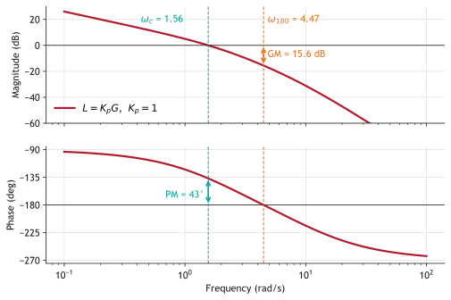
  <figcaption>Margins of the pitch loop with \(K_p = 1\).</figcaption>
</figure>

=== "MATLAB"

    ```matlab
    --8<-- "w03-pid-control/code/p_margins.m"
    ```

=== "Python"

    ```python
    --8<-- "w03-pid-control/code/p_margins.py"
    ```

Raising \(K_p\) moves crossover to higher frequency, where the plant's phase is further round. The loop gets faster, but the phase margin shrinks, so it also gets more oscillatory.

<figure markdown="span">
  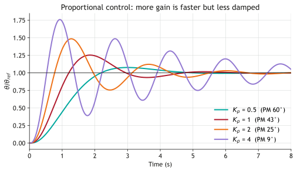
  <figcaption>With proportional control alone, speed and damping pull against each other.</figcaption>
</figure>

## From margins to the step response {#margins-to-time}

For most well-behaved loops the closed-loop response is dominated by a pair of poles near crossover, so it behaves like a second-order system. Two rules of thumb then link the Bode plot to the step response.

**Phase margin sets damping.** For phase margins up to about 70°,

$$
\zeta \approx \frac{PM}{100^\circ}, \qquad M_p = e^{-\pi\zeta/\sqrt{1 - \zeta^2}}.
$$

With \(K_p = 1\), a 43° phase margin suggests \(\zeta \approx 0.43\) and 22% overshoot. The simulation gives 25%. Retuning for a 60° phase margin needs \(K_p = 0.509\) and predicts 9.5% overshoot, against 8.1% simulated.

**Crossover frequency sets speed.** The closed-loop bandwidth is close to \(\omega_c\), and the rise time scales as \(1/\omega_c\). Halving the crossover frequency roughly doubles the rise time. The 60° design crosses over at 0.92 rad/s instead of 1.56, and its rise time grows from 0.76 s to 1.37 s.

<figure markdown="span">
  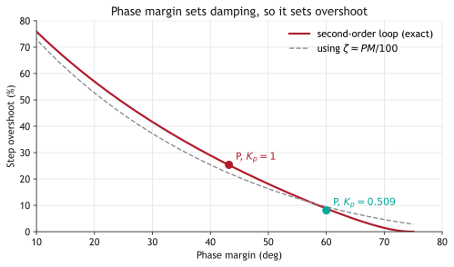
  <figcaption>The two proportional designs sit close to the second-order curve.</figcaption>
</figure>

So proportional control forces a choice: fast with poor damping, or well damped and slow. Getting both needs extra phase near crossover, which is exactly what derivative action provides.

## Steady-state error and system type {#steady-state}

The final value theorem gives the error once transients have died away. For the error \(e = \theta_{ref} - \theta\),

$$
e_{ss} = \lim_{s\to 0} s\,E(s).
$$

The **type** of the loop is the number of integrators in \(L(s)\). Each one removes steady-state error for one more order of reference input.

| Input to the pitch loop | Steady-state error with P control | With integral action |
|---|---|---|
| Step in \(\theta_{ref}\) | 0, because \(G\) is type 1 | 0 |
| Ramp \(\theta_{ref} = \Omega t\), a steady pitch-over | \(\Omega / K_v\), with \(K_v = \lim_{s\to0} sL(s) = 2K_p\) | 0 |
| Step disturbance \(d\) at the elevator | \(d / K_p\) | 0 |

The last row catches people out. The plant's integrator sits *after* the disturbance, so it can't reject it. With a disturbance \(d\) and proportional control,

$$
\theta_{ss} = \lim_{s\to 0} \frac{G(s)}{1 + K_pG(s)}\,d = \frac{d}{K_p}.
$$

A trim change equivalent to 2° of elevator leaves a 2° attitude error when \(K_p = 1\). Only an integrator *before* the disturbance, in the controller, drives this error to zero.

<figure markdown="span">
  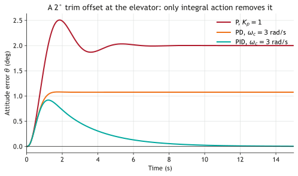
  <figcaption>A constant disturbance at the plant input. Higher proportional gain shrinks the offset, and integral action removes it.</figcaption>
</figure>

## Derivative action {#derivative}

An ideal PD controller is

$$
C(s) = K_p(1 + T_d s),
$$

which adds a zero at \(s = -1/T_d\). Above \(1/T_d\) the magnitude rises at 20 dB per decade and the phase gains up to 90°. The phase lead at crossover is

$$
\phi_{lead} = \tan^{-1}(\omega_c T_d).
$$

That lead is what lets us push crossover higher without losing phase margin.

A pure derivative has unbounded gain at high frequency, which would amplify sensor noise without limit. Real controllers filter it:

$$
C(s) = K_p + \frac{K_d\,s}{T_f s + 1}, \qquad T_d = \frac{K_d}{K_p}, \qquad T_f = \frac{T_d}{N}.
$$

With \(N = 10\) the filter caps the lead at about 56°, and the high-frequency gain at \(K_p(N+1) = 11K_p\). Values of \(N\) between 8 and 20 are typical.

**Designing the PD controller.** We aim for crossover at 3 rad/s, about twice as fast as \(K_p = 1\), with a 60° phase margin.

1. The plant phase at 3 rad/s is \(-90^\circ - \tan^{-1}(1.5) - \tan^{-1}(0.3) = -163.0^\circ\), which would leave only 17° of margin.
2. The controller must therefore add \(60^\circ - 17^\circ = 43^\circ\) of lead at 3 rad/s.
3. Ideal PD needs \(\tan^{-1}(3T_d) = 43^\circ\), so \(T_d = 0.311\) s. The filter takes back a few degrees, so the filtered design needs \(T_d = 0.349\) s.
4. Choose \(K_p\) so that \(|L(j3)| = 1\). That gives \(K_p = 1.86\), and \(K_d = K_pT_d = 0.649\).

<figure markdown="span">
  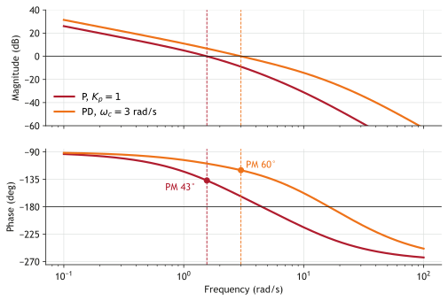
  <figcaption>Derivative action lifts the phase around crossover, so crossover can move up without losing margin.</figcaption>
</figure>

<figure markdown="span">
  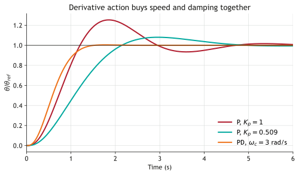
  <figcaption>PD achieves the speed of \(K_p = 1\) with better damping than the 60° proportional design.</figcaption>
</figure>

| Design | \(\omega_c\) (rad/s) | PM | Rise time | Overshoot | 2% settling | Offset per unit \(d\) |
|---|---|---|---|---|---|---|
| P, \(K_p = 0.509\) | 0.92 | 60.0° | 1.37 s | 8.1% | 4.34 s | 1.97 |
| PD, \(K_p = 1.86\), \(K_d = 0.649\) | 3.00 | 60.1° | 0.79 s | 0.5% | 1.31 s | 0.54 |

At the same phase margin, PD rises 1.7 times faster and settles 3.3 times faster. It also has a higher \(K_p\), which cuts the disturbance offset to about a quarter.

### Derivative kick {#derivative-kick}

If the derivative acts on the error, a step in the reference is a step in \(e\), and differentiating a step gives a spike. With the filter in place, the elevator demand in the first instant is

$$
u(0^+) = K_p(N + 1)\,\Delta\theta_{ref}.
$$

For a 10° step with the PD design, that is \(1.86 \times 11 \times 10^\circ = 205^\circ\) of elevator. The elevator can move only 20°.

The fix is to let the derivative act on the **measurement** instead of the error:

$$
u = K_p\,e + K_i\!\int e\,dt - K_d\,\frac{d\theta}{dt}.
$$

Constant references are unaffected. The loop's stability and disturbance rejection are unchanged, because \(L(s)\) is identical, and the kick disappears. The reference response becomes slightly slower, because the reference no longer passes through the lead.

On an aircraft, \(d\theta/dt\) is the pitch rate \(q\), which a rate gyro measures directly. So D on measurement is simply **pitch-rate feedback**, the classic pitch damper. It needs no numerical differentiation at all.

<figure markdown="span">
  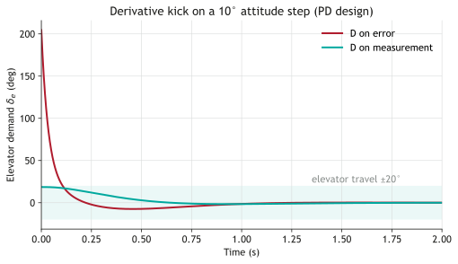
  <figcaption>Derivative kick. Only the D-on-measurement demand stays within the elevator's travel.</figcaption>
</figure>

## Integral action {#integral}

A PI controller is

$$
C(s) = K_p\left(1 + \frac{1}{T_i s}\right) = K_p\,\frac{T_i s + 1}{T_i s}, \qquad K_i = \frac{K_p}{T_i}.
$$

It adds an integrator and a zero at \(s = -1/T_i\). Below \(1/T_i\) the loop gain rises without limit as frequency falls, so the loop gains a type. Constant disturbances now give zero steady-state error. The price is phase lag at crossover:

$$
\phi_{lag} = \tan^{-1}\!\left(\frac{1}{\omega_c T_i}\right).
$$

Placing the zero a factor of 5 to 10 below crossover keeps this to between 6° and 11°. Here \(T_i = 3\) s and \(\omega_c = 3\) rad/s, so the lag is \(\tan^{-1}(1/9) = 6.3^\circ\).

Adding integral action to the PD design would cost those 6°. So we redo the derivative design with the integral term included, for crossover at 3 rad/s and a 55° phase margin. The result is

$$
K_p = 2.03, \qquad K_i = 0.678, \qquad K_d = 0.661 \qquad (T_i = 3.0\ \text{s},\ T_d = 0.326\ \text{s},\ N = 10).
$$

<figure markdown="span">
  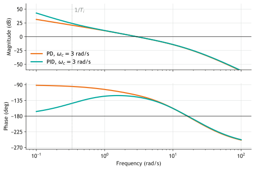
  <figcaption>Integral action raises the loop gain at low frequency and barely changes it near crossover.</figcaption>
</figure>

The disturbance offset is now removed, as the disturbance figure above shows. There is a cost in the reference response, though. The closed loop has a slow pole near the PI zero at \(-1/T_i\), which gives a slow final approach. Overshoot also rises to 18.7%, because the reference passes through the PI zero. The 2% settling time lengthens from 1.3 s to 6.9 s, even though the rise time improves.

<figure markdown="span">
  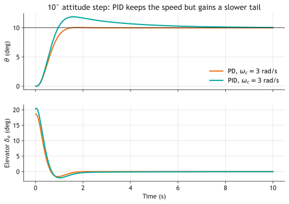
  <figcaption>Integral action trades a slower tail for zero offset under disturbances.</figcaption>
</figure>

A larger \(T_i\) shortens the overshoot and lengthens the time taken to remove a disturbance. If the reference response matters more, the standard fixes are to weight the reference in the proportional term or to add a prefilter. Both reshape the reference response without touching the loop.

## Tuning PID by loop shaping {#pid-tuning}

The steps above make a procedure you can repeat on any plant with a Bode plot.

1. **Choose the crossover frequency** from the speed you need. Keep it well below the actuator bandwidth and any structural modes. For this plant 3 rad/s sits comfortably below the 10 rad/s servo.
2. **Choose the phase margin** from the overshoot you can accept. 50° to 60° is typical.
3. **Choose \(T_i\)** so that \(1/T_i\) is 5 to 10 times below crossover, and note the phase it costs.
4. **Find the lead needed** at crossover: \(\phi_{lead} = PM - 180^\circ - \angle G(j\omega_c) + \phi_{lag}\). Solve for \(T_d\), with a filter of \(N\) between 8 and 20.
5. **Set \(K_p\)** so that \(|L(j\omega_c)| = 1\).
6. **Check** the gain margin, the peak actuator demand for a typical step, the noise gain \(K_p(N+1)\), and the step and disturbance responses. Then iterate.

| Design | \(K_p\) | \(K_i\) | \(K_d\) | \(\omega_c\) | PM | GM | Overshoot | Peak \(\delta_e\), 10° step | Offset per unit \(d\) |
|---|---|---|---|---|---|---|---|---|---|
| P | 1.00 | — | — | 1.56 | 43.2° | 6.0 (15.6 dB) | 25.4% | 10.0° | 1.00 |
| P | 0.509 | — | — | 0.92 | 60.0° | 11.8 (21.4 dB) | 8.1% | 5.1° | 1.97 |
| PD | 1.86 | — | 0.649 | 3.00 | 60.1° | 12.4 (21.9 dB) | 0.5% | 18.6° | 0.54 |
| PID | 2.03 | 0.678 | 0.661 | 3.00 | 55.0° | 12.4 (21.9 dB) | 18.7% | 20.4° | 0 |

=== "MATLAB"

    ```matlab
    --8<-- "w03-pid-control/code/pid_loop.m"
    ```

=== "Python"

    ```python
    --8<-- "w03-pid-control/code/pid_loop.py"
    ```

Empirical rules such as Ziegler–Nichols tuning also exist. They are useful when you have a plant but no model. With a model, loop shaping tells you *why* a set of gains works, and what to change when it doesn't.

### Try it {#applet}

The applet below simulates the same loop. Move the sliders and watch the Bode plot and step response change together. It starts at the PID design above.

<figure class="applet" markdown="span">
  <iframe src="../applets/pid-tuner.html?kp=2.03&ki=0.678&kd=0.661&n=10" title="Interactive PID tuner for the pitch-attitude loop" loading="lazy"></iframe>
  
  <figcaption>PID tuner. Try switching the derivative to act on the error, turning on the elevator limit, or adding a disturbance.</figcaption>
</figure>

Things to try:

- Set \(K_i = K_d = 0\) and raise \(K_p\) until the gain margin reaches zero. Check that this happens at \(K_p = 6\).
- Starting from the PD design, add integral action and watch the phase margin fall by about 6°.
- Switch the derivative to act on the error and watch the elevator demand for a step.
- Turn on the ±20° elevator limit, command a 25° step, and compare the response with and without anti-windup.

## Actuator limits and integrator windup {#windup}

Linear analysis assumes the elevator does whatever it is told. When a large command saturates it, the loop is effectively open. The error stays large, and the integrator keeps accumulating. By the time the attitude reaches its target, the integrator holds far more than it needs. It has to unwind through an overshoot before the loop settles. This is **integrator windup**.

<figure markdown="span">
  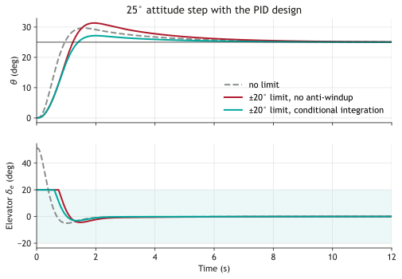
  <figcaption>A 25° step saturates the elevator. Conditional integration stops the integrator winding up while the elevator is at its limit.</figcaption>
</figure>

| 25° step with the PID design | Overshoot | 2% settling |
|---|---|---|
| No elevator limit, linear | 18.7% | 6.9 s |
| ±20° limit, no anti-windup | 25.4% | 8.0 s |
| ±20° limit, conditional integration | 8.7% | 5.4 s |

Two standard fixes are:

- **Conditional integration, or clamping.** Stop integrating while the actuator is saturated and the error would push it further into the limit. That is what the figure uses.
- **Back-calculation.** Feed the difference between the commanded and the achieved actuator position back into the integrator, so that it tracks what the actuator is actually doing.

Rate-limiting large reference changes also helps, because it keeps the actuator out of saturation in the first place.

## Summary {#summary}

| Term | Bode plot | Step response | Cost |
|---|---|---|---|
| P, \(K_p\) | Slides the magnitude up or down; phase unchanged | Faster, but less damped as the gain rises | Can't give speed and damping together |
| I, \(K_i = K_p/T_i\) | Unlimited gain at low frequency; lag near \(1/T_i\) | Removes offsets from constant disturbances | Phase lag at crossover, a slower tail, windup |
| D, \(K_d = K_pT_d\) | Phase lead around \(1/T_d\) | Allows a higher crossover with the same damping | Noise gain \(K_p(N+1)\); kick unless it acts on the measurement |

- Design \(L(j\omega)\): the crossover frequency sets speed, and the phase margin sets damping.
- Integrators in the controller, before the disturbance, remove constant disturbance errors. Integrators in the plant don't.
- On aircraft, derivative action is rate feedback from a gyro.
- Always check actuator demand, and protect the integrator from saturation.

## Further reading {#further-reading .no-slides}

- K. J. Åström and R. M. Murray, *Feedback Systems: An Introduction for Scientists and Engineers*, 2nd edition, Princeton University Press. Chapter 11 covers PID control. A free copy is available from the authors.
- G. F. Franklin, J. D. Powell and A. Emami-Naeini, *Feedback Control of Dynamic Systems*, Pearson. The frequency-response design chapter covers lead and lag compensation, which PD and PI are special cases of.
- B. L. Stevens, F. L. Lewis and E. N. Johnson, *Aircraft Control and Simulation*, Wiley. Covers pitch-attitude autopilots and stability augmentation.
- K. J. Åström and T. Hägglund, *Advanced PID Control*, ISA. Covers anti-windup, setpoint weighting and practical PID tuning.
