

<!-- _class: title -->

# PID, properly

## Lecture 3 · CADE30008 Flight Dynamics & Control

Dr. Steve Bullock

<!--
Lecture 2 of CADE30008. We skip the recap lecture: students have the year 2
unit, so Bode plots and step-response specs are assumed.
-->

---

# Today

We design a pitch-attitude controller for a small UAV, one term at a time.

- **P**: what gain alone can and can't do
- **Margins and the step response**: reading overshoot and speed off a Bode plot
- **Steady-state error**: why the aircraft's own integrator isn't enough
- **D**: phase lead, and the kick that comes with it
- **I**: removing offsets, and what that costs
- **A repeatable tuning procedure**, and what actuator saturation does to it

<!--
The handout has everything in full, with derivations and code in Python and
MATLAB. The example sheet takes about an hour.
-->

---

<!-- handout: recap -->

# The loop

$$
L(s) = C(s)\,G(s),
$$

$$
\theta(s) = \underbrace{\frac{L(s)}{1 + L(s)}}_{T(s)}\,\theta_{ref}(s) \;+\; \underbrace{\frac{G(s)}{1 + L(s)}}_{\text{disturbance path}}\,d(s).
$$

<!--
The disturbance d enters with the elevator command: a trim change, a CG
shift. Everything about the closed loop follows from L.
-->

---

<!-- handout: recap -->

# Reading L(jω) on a Bode plot

### Where |L| ≫ 1

- $T \approx 1$, so the attitude follows the reference
- Disturbances are suppressed by the controller gain

### Where |L| ≪ 1

- $T \approx L$, so feedback has stopped acting

### At crossover, |L(jωc)| = 1

- The crossover frequency $\omega_c$ sets **speed**
- The phase margin sets **damping**

Designing a controller means shaping $L(j\omega)$: gain at low frequency, crossover where you want it, and phase margin when you get there.

---

<!-- handout: pitch-loop -->

# Our aircraft: pitch attitude from elevator

| Effect | Transfer function | Meaning |
|---|---|---|
| Pitch-rate response | $\dfrac{2}{0.5s + 1}$ | 1 rad of elevator gives 2 rad/s, with a 0.5 s lag |
| Elevator servo | $\dfrac{1}{0.1s + 1}$ | About 0.1 s of lag |
| Attitude | $\dfrac{1}{s}$ | Attitude integrates pitch rate |

$$
G(s) = \frac{\theta(s)}{\delta_e(s)} = \frac{40}{s(s + 2)(s + 10)}.
$$

The elevator travels ±20°.

<!--
The short-period mode is lumped into one time constant here. Later lectures
use the full short-period model; the method doesn't change.
-->

---

<!-- handout: pitch-loop -->

# The plant's Bode plot

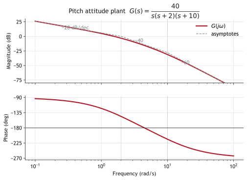

<!--
Point out the integrator (already type 1) and that the phase crosses -180,
so enough gain will destabilise it.
-->

---

<!-- _class: section -->

# Proportional control

## One knob: gain

---

<!-- handout: proportional -->

# P control slides the magnitude, not the phase

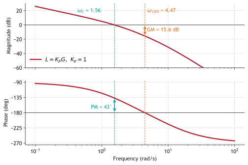

With Kp = 1: crossover 1.56 rad/s, phase margin 43.2°, gain margin 15.6 dB.

---

<!-- handout: proportional -->

# Where does it go unstable?

The phase reaches −180° where $\tan^{-1}(\omega/2) + \tan^{-1}(\omega/10) = 90^\circ$, which needs $(\omega/2)(\omega/10) = 1$.

So $\omega_{180} = \sqrt{20} = 4.47$ rad/s, and there

$$
|G(j\omega_{180})| = \frac{40}{\sqrt{20}\,\sqrt{24}\,\sqrt{120}} = \frac{40}{240} = \frac{1}{6},
$$

- With $K_p = 1$ the gain margin is **6**, or 15.6 dB
- Any $K_p > 6$ makes the loop **unstable**

<!--
Worth doing live on the board: the tan-addition trick makes it exact.
-->

---

<!-- handout: proportional -->

# More gain: faster, but less damped

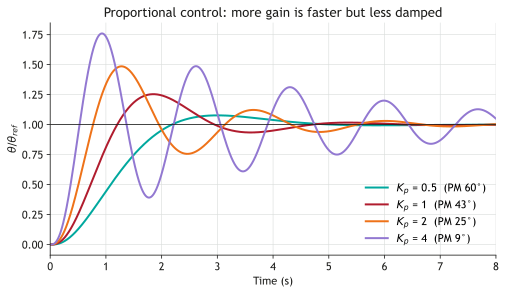

<!--
Raising Kp pushes crossover to where the plant has more phase lag, so the
phase margin shrinks. Speed and damping pull against each other.
-->

---

<!-- handout: margins-to-time -->

# From margins to the step response

**Phase margin sets damping**, for margins up to about 70°:

$$
\zeta \approx \frac{PM}{100^\circ}, \qquad M_p = e^{-\pi\zeta/\sqrt{1 - \zeta^2}}.
$$

- $K_p = 1$: 43° margin suggests 22% overshoot; simulation gives 25%
- $K_p = 0.509$: 60° margin predicts 9.5% overshoot; simulation gives 8.1%

**Crossover frequency sets speed**: rise time scales as $1/\omega_c$. The 60° design crosses at 0.92 rad/s instead of 1.56, and its rise time grows from 0.76 s to 1.37 s.

---

<!-- handout: margins-to-time -->

# Phase margin predicts overshoot

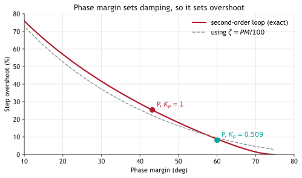

<!--
So P forces a choice: fast and poorly damped, or well damped and slow. We need
extra phase near crossover to get both, which is what D gives us.
-->

---

<!-- handout: steady-state -->

# Steady-state error and system type

The type of the loop is the number of integrators in $L(s)$.

| Input to the pitch loop | Error with P control | With integral action |
|---|---|---|
| Step in $\theta_{ref}$ | 0, because $G$ is type 1 | 0 |
| Ramp $\theta_{ref} = \Omega t$ | $\Omega / K_v$, with $K_v = 2K_p$ | 0 |
| Step disturbance $d$ at the elevator | $d / K_p$ | 0 |

<!--
Ask the room which row will surprise them. It's the last one.
-->

---

<!-- handout: steady-state -->

# The catch: disturbances enter before the integrator

$$
\theta_{ss} = \lim_{s\to 0} \frac{G(s)}{1 + K_pG(s)}\,d = \frac{d}{K_p}.
$$

A trim change worth 2° of elevator leaves a **2° attitude error** with $K_p = 1$.

Only an integrator in the **controller**, before the disturbance, removes it.

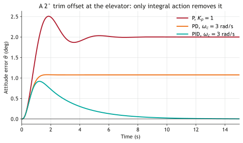

---

<!-- _class: section -->

# Derivative action

## Buying phase at crossover

---

<!-- handout: derivative -->

# PD adds phase lead

$$
C(s) = K_p(1 + T_d s),
$$

$$
\phi_{lead} = \tan^{-1}(\omega_c T_d).
$$

In practice the derivative is filtered:

$$
C(s) = K_p + \frac{K_d\,s}{T_f s + 1}, \qquad T_d = \frac{K_d}{K_p}, \qquad T_f = \frac{T_d}{N}.
$$

- With $N = 10$, the lead is capped at about 56°
- The high-frequency gain is $K_p(N+1) = 11K_p$: noise

---

<!-- handout: derivative -->

# Designing PD: crossover at 3 rad/s, 60° margin

1. Plant phase at 3 rad/s: $-90^\circ - \tan^{-1}(1.5) - \tan^{-1}(0.3) = -163.0^\circ$, leaving only 17°
2. The controller must add $60^\circ - 17^\circ = 43^\circ$ of lead
3. Ideal PD: $\tan^{-1}(3T_d) = 43^\circ$ gives $T_d = 0.311$ s. With the filter, $T_d = 0.349$ s
4. Set $|L(j3)| = 1$: $K_p = 1.86$, and $K_d = K_pT_d = 0.649$

<!--
This is the whole method in miniature. The rest of the lecture reuses it.
-->

---

<!-- handout: derivative -->

# Lead lifts the phase around crossover

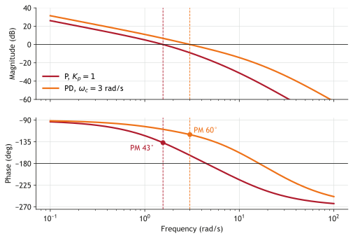

---

<!-- handout: derivative -->

# Speed and damping together

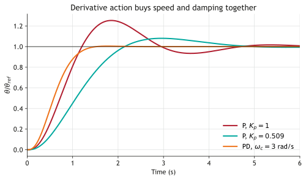

| | P, $K_p = 0.509$ | PD |
|---|---|---|
| $\omega_c$ | 0.92 | 3.00 |
| PM | 60.0° | 60.1° |
| Rise time | 1.37 s | 0.79 s |
| Overshoot | 8.1% | 0.5% |
| 2% settling | 4.34 s | 1.31 s |
| Offset per unit $d$ | 1.97 | 0.54 |

---

<!-- handout: derivative-kick -->

# Derivative kick

With D on the error, a reference step is differentiated:

$$
u(0^+) = K_p(N + 1)\,\Delta\theta_{ref}.
$$

A 10° step gives about **205°** of elevator. It can move 20°.

**Fix: D on the measurement.** On an aircraft that's just **pitch-rate feedback** from a gyro, the classic pitch damper.

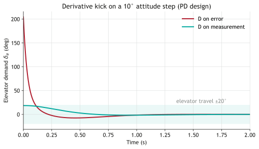

<!--
L(s) is unchanged, so stability and disturbance rejection are identical. Only
the reference path loses the lead, which makes it slightly slower.
-->

---

<!-- _class: section -->

# Integral action

## Removing the offset

---

<!-- handout: integral -->

# PI adds a type, and costs phase

$$
C(s) = K_p\left(1 + \frac{1}{T_i s}\right) = K_p\,\frac{T_i s + 1}{T_i s}, \qquad K_i = \frac{K_p}{T_i}.
$$

$$
\phi_{lag} = \tan^{-1}\!\left(\frac{1}{\omega_c T_i}\right).
$$

- Place $1/T_i$ five to ten times below crossover: 6° to 11° of lag
- Here $T_i = 3$ s at $\omega_c = 3$ rad/s costs 6.3°
- Redesign including that lag, for a 55° margin:

$$
K_p = 2.03, \qquad K_i = 0.678, \qquad K_d = 0.661 \qquad (T_i = 3.0\ \text{s},\ T_d = 0.326\ \text{s},\ N = 10).
$$

---

<!-- handout: integral -->

# What integral action buys, and costs

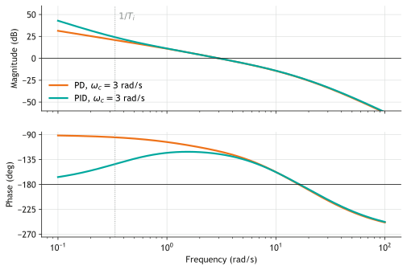

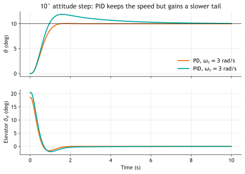

Offset removed. But a slow pole near $-1/T_i$ gives a slow tail: overshoot rises to 18.7% and 2% settling grows from 1.3 s to 6.9 s.

---

<!-- handout: pid-tuning -->

# Tuning PID by loop shaping

1. **Choose the crossover frequency** from the speed you need, below actuator bandwidth
2. **Choose the phase margin** from the overshoot you can accept: 50° to 60°
3. **Choose $T_i$** with $1/T_i$ five to ten times below crossover
4. **Find the lead needed**, and solve for $T_d$ with a filter of $N$ between 8 and 20
5. **Set $K_p$** so that $|L(j\omega_c)| = 1$
6. **Check** gain margin, peak actuator demand, noise gain and responses, then iterate

---

<!-- handout: pid-tuning -->

# Four designs compared

| Design | $K_p$ | $K_i$ | $K_d$ | $\omega_c$ | PM | Overshoot | Peak $\delta_e$, 10° step | Offset per unit $d$ |
|---|---|---|---|---|---|---|---|---|
| P | 1.00 | — | — | 1.56 | 43.2° | 25.4% | 10.0° | 1.00 |
| P | 0.509 | — | — | 0.92 | 60.0° | 8.1% | 5.1° | 1.97 |
| PD | 1.86 | — | 0.649 | 3.00 | 60.1° | 0.5% | 18.6° | 0.54 |
| PID | 2.03 | 0.678 | 0.661 | 3.00 | 55.0° | 18.7% | 20.4° | 0 |

<!--
Note the PID's peak elevator for a 10 degree step: 20.4 degrees, just past the
limit. That motivates the windup slide.
-->

---

<!-- _class: blank-logo -->
<!-- handout: applet -->

# Try it: PID tuner

<iframe src="../../docs/applets/pid-tuner.html?kp=2.03&ki=0.678&kd=0.661&n=10" width="1136" height="540" title="Interactive PID tuner for the pitch-attitude loop"></iframe>
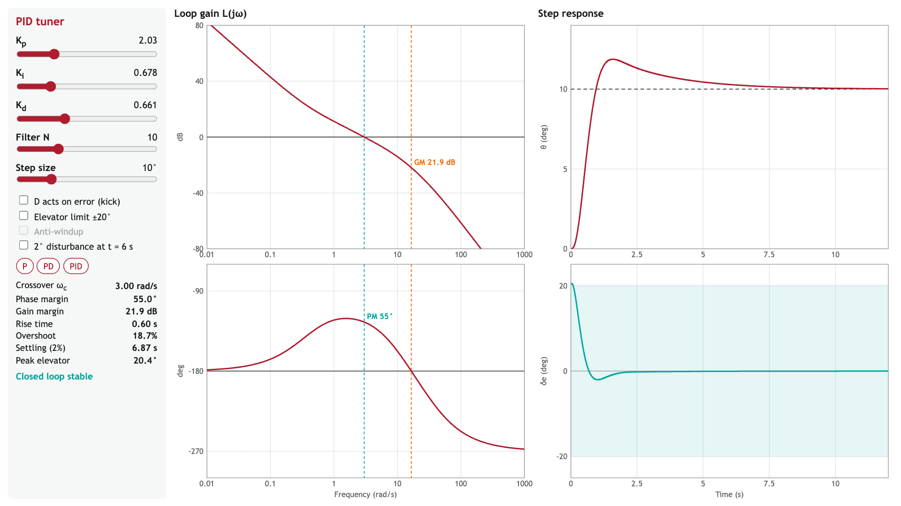

<!--
Live demo. Set Ki = Kd = 0 and raise Kp to 6. Then PD, add Ki. Then switch D
to the error and show the elevator. Then the 25 degree step with the limit on.
-->

---

<!-- handout: windup -->

# Actuator limits and integrator windup

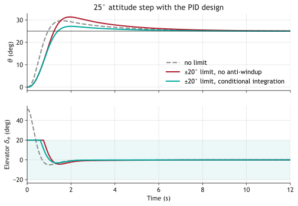

While the elevator is saturated the loop is effectively open, and the integrator keeps accumulating.

| 25° step | Overshoot | 2% settling |
|---|---|---|
| No limit | 18.7% | 6.9 s |
| ±20°, no anti-windup | 25.4% | 8.0 s |
| ±20°, conditional integration | 8.7% | 5.4 s |

Fixes: conditional integration, back-calculation, rate-limited references.

---

<!-- handout: summary -->

# Summary

| Term | Bode plot | Step response | Cost |
|---|---|---|---|
| P | Slides the magnitude; phase unchanged | Faster, less damped | Can't give speed and damping together |
| I | Unlimited gain at low frequency | Removes disturbance offsets | Phase lag, a slower tail, windup |
| D | Phase lead around $1/T_d$ | Higher crossover, same damping | Noise gain; kick unless on the measurement |

Design $L(j\omega)$: crossover sets speed, phase margin sets damping. On aircraft, D is rate feedback from a gyro.

---

<!-- _class: title-inverted -->

# Example sheet

## About an hour: hand calculations, then Python or MATLAB

Handout, example sheet and solutions are on the course site
