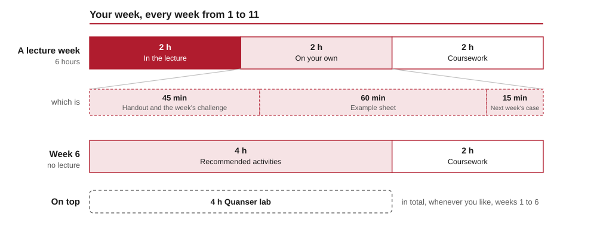

<!-- _class: title -->

# The design cycle, end to end

## Week 1 · CADE30008 Flight Dynamics & Control

Dr. Steve Bullock

<!--
Presenter notes. Anything in an HTML comment becomes a note rather than slide
content, and does not appear on the slide itself.
-->

---

<!-- handout: recap -->

# Where we are

* what the student already knows
* where it came from
* why it is not yet enough

---

<!-- handout: idea-one -->

# First idea

* the idea, in one line
* what it changes
* what it costs

---

<!-- handout: idea-two -->

# Second idea

* the idea, in one line
* how it builds on the first
* when it applies

---

<!-- handout: worked-example -->

# Worked example

* the set-up
* the design step
* the result, and whether it met the specification

---

<!-- handout: schedule -->

# The term, week by week

<!--
The whole term. Week 5 is the guest lecture; week 6 is consolidation week, with no lecture.
Coursework is due on the Thursday of week 11. The laboratory is open access:
students choose when to go, from week 1 to week 6.
-->

---

<!-- handout: workload -->

# Your week

**Do the coursework in the week.** Leaving it to the end means learning it twice, alone.

<!--
The coursework builds week by week; each step uses that week's lecture, and the
checkpoints give feedback while it can still change the design. Many students
back-load it. Say plainly why that costs them.
-->

---

<!-- handout: assessment -->

# What counts

* **One piece carries the grade:** the coursework, due Thursday of week 11
* Everything else is **formative** — it doesn't contribute to your grade *directly*
* **But it is how the coursework gets built.** The checkpoints *become* the paper
* Checkpoints in weeks 4, 8 and 9: automatic checks, cohort feedback, peer review
* Nothing formative is randomised. Work on it together if you like

<!--
Say plainly that formative isn't optional-and-pointless: each checkpoint is a
draft of part of the final paper, and the decision log becomes its last section.
Do it as you go and week 11 is assembly, not writing from nothing.
-->

---

<!-- handout: ai -->

# AI rewards expertise

* Anyone can produce seemingly passable work — until an expert, or the real world, checks it
* Experts ask sharper questions, and catch the confident wrong answers
* Terence Tao and ChatGPT, 20 July 2026: the value was his judgement, not the prompt
* The fundamentals here are what make you good *with* AI

**A design in a domain you don't understand, produced by a tool you don't understand and can't check, runs the risk of being a gamble that it's right.** That's not responsible, not ethical, and not engineering.

<!--
After Sean Goedecke, "LLMs reward expertise", which uses Tao's conversation on
the Jacobian conjecture as its example. Tao, among other researchers, models
and critiques genuinely productive uses of LLMs.

The callout is the one to slow down on. Aviation makes it concrete: somebody
signs off a control law, and "the tool said so" has never been a defence.
-->

---

<!-- handout: ai -->

# Learning is how experts are made

* Tao and 24 other Fields Medallists, September 2026:
* training exists to build understanding, not only to produce answers
* when AI produces the answers directly, the two come apart
* That's your development — and what we're trying to assess

<!--
"A severe misalignment of AI in mathematics", on Tao's blog. The point for us is
the one about training: students are set problems to build skills, and a
shortcut to the answer skips the building.
-->

---

<!-- handout: ai -->

# Work, or gym?

* **Work**: only the result matters. AI is a sensible tool — if you check it and stand behind it
* **Gym**: doing it is the point. AI is a machine lifting your weights
* A Simulink error at eleven at night: mostly work
* Why your loop has less phase margin than you expected: the gym
* Most of what you do here is the gym

<!--
After Bruce Schneier's test. The caveat on "work" is mine: in engineering,
someone is accountable, and your name is on it either way. The coursework's AI
rules follow the same line: use it where the brief allows, you won't need it,
and you own what you submit. I used AI to help make these materials; the
pedagogy and content are mine, and I have checked and rewritten all of it.
-->

---

<!-- handout: ai -->

# What you're here to build

**Judgement:** knowing a plausible answer is wrong, before you can say why.
**Taste:** knowing which of several correct designs is the good one.

**Nobody can hand you either — not me, not a model. Do the hard part.**

<!--
Say this one in your own voice. It is the slide that is meant to be
aspirational rather than cautionary, so give it a beat — taste is a word
students are almost never offered about engineering, and it lands.

The caution belongs here, spoken, not on the slide: work a model produced and
nobody examined tends to mark poorly, and not as a punishment - the credit
follows the reasoning, and there isn't any. Say it once, plainly, then move on.

And one practical warning worth saying out loud, because it is the way a
student gets this wrong while trying to get it right:

  "The AI category is set per assessment, not per subject. This coursework is
  Category 3, Selective. You will have met Category 2, Minimal, on other units,
  including ones in this same field, where it is permitted only for limited and
  declared purposes. Don't carry last year's rules forward — read the brief."

Deliberately not on the website: it is about this cohort's assessments rather
than about control, and it dates.
-->

---

<!-- handout: ai -->

# Where this comes from

- **Sean Goedecke**, *LLMs reward expertise*
- **Terence Tao and 24 other Fields Medallists**, September 2026, on AI and mathematics
- **Bruce Schneier**, the work-or-gym test, in *The Guardian*
- All three, with links: the **AI in this course** page

<!--
Links are on the site rather than read out. The point of the slide is that this
is a considered position with sources, not a departmental rule.
-->

---

<!-- handout: summary -->

# Summary

- first takeaway
- second takeaway
- third takeaway
