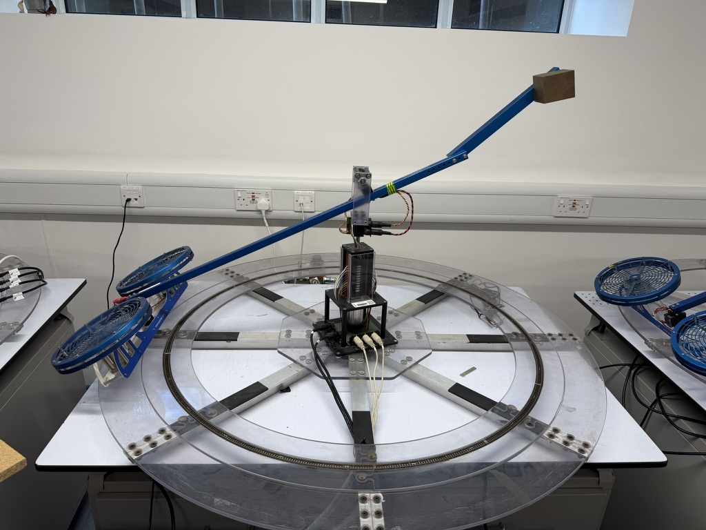
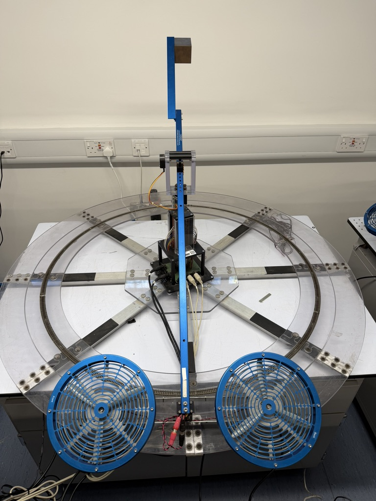
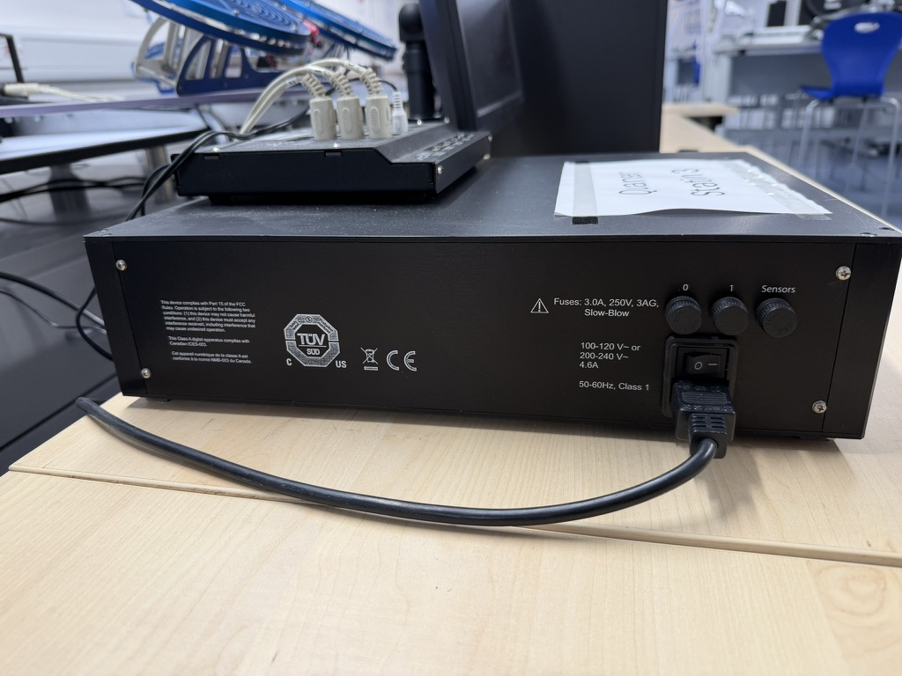
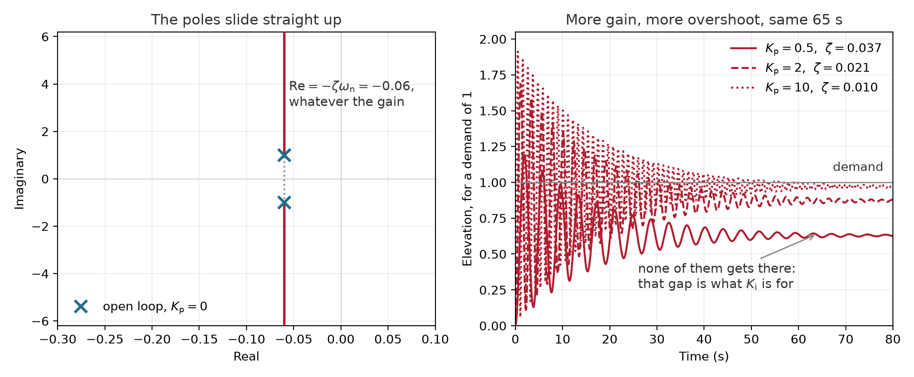

<!-- _class: title -->

# The design cycle, end to end

## Week 1 · CADE30008 Flight Dynamics & Control

Dr. Steve Bullock

<!--
Presenter notes. Anything in an HTML comment becomes a note rather than slide
content, and does not appear on the slide itself.
-->

---

<!-- _class: section -->

# The claim

## Made now, tested in half an hour

---

<!-- handout: the-rig -->

# This machine cannot be flown by hand

**One of you is going to try.**

<!--
Five minutes, no more. Make the claim flatly and do not justify it yet: the
whole point is that it stays unproven while they sit through the design cycle.

Define the task and the failure before you take the vote, or the vote may
never resolve. Elevation is stable, so the beam will not fall, and travel has
no stop to hit: a cautious volunteer can drift round the track for a minute
having done nothing wrong.

So set a task with a losing condition in it. Something like: hold the beam at
the marked elevation, pointing at the marker, for 30 seconds; it is over when
it leaves plus or minus 10 degrees or goes past the marker. Pick your own
numbers, say them out loud, then vote on how long they last. Under 5, 5-15,
15-60, over 30 s and they win.

P12: committing to a prediction out loud is what makes the result register
rather than wash over them.

Ask for the volunteer now too, so they have half an hour to get nervous, and
so nobody feels ambushed at minute 30. Pick someone who will enjoy it.
-->

---

<!-- _class: section -->

# Why control exists

## And the shape of the work

---

<!-- handout: recap -->

# You already have the mathematics

- Laplace transforms, transfer functions, poles and zeros
- Standard second-order form: what ζ and ωn do to a response
- Bode plots from first- and second-order factors
- PID, in its parallel form

**What is new is not a technique. It is the shape of the work.**

<!--
Deliberately fast. This is a reassurance slide, not a teaching slide: they have
all of this, from more than one route in, and some of them are worried they do
not.

Point at the prerequisite diagnostic once, say it does not count towards
anything, and move on. Eleven questions, feedback on every option. Do not sell
it twice.
-->

---

<!-- handout: design-cycle -->

# Control design is a loop

1. **Understand the plant.** What it does, not what the datasheet says
2. **State the requirement.** In numbers, before designing
3. **Design.** Structure, gains, a prediction
4. **Validate in simulation.** Does it meet the requirement?
5. **Test on hardware.** Does it *really*?
6. **Go round again**, because 5 disagreed with 4

**Today you do all six. Badly. Once.** Everything after today is one of these steps, done properly.

<!--
This is the spine of the unit and the slide to slow down on. Name where each
later week sits: loop shaping is step 3, model validation is the gap between 4
and 5, robustness is what you do when you know step 1 is wrong.

The "badly, once" line matters. They will produce a mediocre controller today
and that is the intention: the point is the circuit, not the lap time.
-->

---

<!-- _class: section -->

# Feedback

## What it gives, and what it costs

---

<!-- handout: feedback-trade -->

# Feedback is a trade, not a fix

**You get, for free:**

- disturbance rejection
- insensitivity to the plant
- the ability to stabilise something unstable

**You pay, unavoidably:**

- sensor noise reaches the output
- the loop can go unstable, which the open plant could not
- **more gain brings more of both**

<!--
The last line is the one to hold. Almost every design decision in this unit is
a choice about where to spend loop gain, and "turn it up" is never a whole
answer.

Do not let them leave thinking feedback is an improvement. It makes the system
different, and you choose which problems to have. That framing gets used again
in robustness and in loop shaping.
-->

---

<!-- _class: section -->

# The machine

## Three axes, two motors

---

<!-- handout: the-rig -->

# Elevation, pitch, travel

| | | |
|---|---|---|
| **Elevation** ε | how high the beam sits | zero when level |
| **Pitch** ρ | how the motor pair tilts | positive: front motor higher |
| **Travel** λ | how it swings round | positive: counter-clockwise from above |

<!--
Conventions are Quanser's own, from the Laboratory Guide. Worth being exact
about the signs now, because a plot with the wrong sign convention wastes
twenty minutes in the laboratory later.

The thing to say out loud: three axes, two motors. Elevation is the sum of the
rotor voltages, pitch the difference, and travel is not commanded at all - it
happens because pitch tilts the thrust and the machine slides round after it.
That is the coupling that makes hand-flying hard.
-->

---

<!-- handout: the-rig -->

# Before anything is switched on

**The amplifier's rocker switch is the emergency stop.** No separate button, no software interlock. Know where it is before the motors spin.

<!--
Lecturer-led, deliberately, and not hurried. This is the one slide where being
boring is correct.

Say plainly that there is no stop button: the risk assessment covers the rig as
it is, with the amplifier switch as the means of isolation, and pretending
otherwise would be worse than saying it. Same message again at the start of
every open-access session.

Physically point at the switch on the actual bench, not just the photograph.
-->

---

<!-- _class: section -->

# The attempt

## Two joysticks, three axes

---

<!-- handout: the-rig -->

# Fly it

**Open loop. Two joysticks. All three axes.**

Hold the marked elevation, on the marker, for 30 seconds.

Everyone else: count.

<!--
This is minute 30 and the payoff for the claim at minute 5. Hand over, get out
of the way, and let it fail in public. Do not coach, do not rescue early, and
do not fill the silence.

Before they start: remind the room of their vote. After it ends: put the actual
number against the vote on the board.

Be kind afterwards, and be specific that the failure is the machine's fault and
not the pilot's. The next slide is the argument for that, so get to it quickly.
-->

---

<!-- handout: the-rig -->

# Why a person loses to this

- The oscillation **does not die away** on its own
- Every correction arrives **slightly too late**, and makes it bigger
- Fixing elevation with pitch **sends it round the track**
- You are controlling **three coupled things with two levers**

**None of this is about reflexes.**

<!--
Head this off explicitly: somebody will think a better pilot would have managed
it, and a few will think they personally would have. Say that a human is a
perfectly good controller of well-damped things and a poor one of lightly
damped coupled things, and that the fix is not practice.

This is also the honest motivation for simplifying. We are not taking one axis
because three is too advanced for week one. We are taking one axis because
three at once is the thing that just beat a volunteer in front of everybody.
-->

---

<!-- _class: section -->

# One axis

## And a model of it

---

<!-- handout: elevation -->

# Elevation, measured

$$ G(s) = \frac{\varepsilon(s)}{V(s)} = \frac{K\,\omega_\mathrm{n}^{2}}{s^{2} + 2\zeta\omega_\mathrm{n}s + \omega_\mathrm{n}^{2}} $$

K ≈ **3.4** deg/V  ·  ωn ≈ **1.0** rad/s  ·  ζ ≈ **0.06**

- **Stable.** Disturb it and it does come back
- ζ = 0.06 is **almost no damping**: six-second period, about a minute to settle
- Nudge it and walk away, and it is still moving when you return

<!--
Say where the numbers came from: a step response measured on this rig, not a
datasheet and not a derivation. They fit their own shortly and will not get
exactly these, which is the point of the exercise rather than a flaw in it.

Contrast with the three-axis machine they just watched: one axis, held still,
is a thing you can write on a slide. That is what simplification gets you.
-->

---

<!-- handout: elevation -->

# "Turn the gain up" does not work here

$$ s^{2} + 2\zeta\omega_\mathrm{n}s + \omega_\mathrm{n}^{2}(1 + KK_\mathrm{p}) $$

**Kp is not in the coefficient of s.**

<!--
The algebra is the whole argument, so write it rather than assert it. Kp is
absent from the s coefficient, so the real part of the poles is pinned at
-zeta*omega_n = -0.06 however hard you push.

Numbers, if they want them: Kp from 0.5 to 10 takes overshoot from 89% to 97%
and leaves settling time at 65 seconds. More gain gets you a worse response and not
one second of settling.

Where it goes next: damping has to come from somewhere other than Kp, which is
the derivative term; and the gap to the demand needs something with memory,
which is the integral term. That is the controller, motivated rather than
announced.
-->

---

<!-- _class: section -->

# What counts as good?

## Agreeing it before we design

---

<!-- handout: requirements -->

# A requirement is a number with a test

| Quantity | Means | Typical |
|---|---|---|
| Overshoot Mp | how far past it goes | "no more than 20%" |
| Settling time ts | until it stays in a band | "within 2% inside 8 s" |
| Steady-state error | what is left at the end | "under 1 degree" |

**"Make it fly well" cannot be met, missed, or argued about.**

<!--
Always name the band with a settling time. We use 2% throughout, which is what
stepinfo and Dorf both default to. A settling time quoted against an unnamed
band is unreadable rather than wrong.

Then do it live: agree today's requirement in the room, out loud, and write it
on the board where it stays for the rest of the session. Take suggestions,
push back on anything unmeasurable, and settle on one.

The order is the teaching point. A requirement chosen after the design is a
description, not a specification.
-->

---

<!-- _class: section -->

# System identification

## Getting the model from the machine

---

<!-- handout: system-id -->

# Three numbers, three measurements

- **Period** of the oscillation → damped frequency, ωd = 2π/Td
- **Ratio of successive peaks** → damping ratio, by log decrement
- **Steady value** → the gain

Do it **by hand first**. `tfest` fits any order in one line, so reach the floor before the ceiling.

<!--
Why by hand at all, when one function does it: a fit you got by hand is one you
can argue with, and a fit that arrived from a function is one you can only
accept. They will use tfest for the rest of their careers and should know what
it is doing.

Warn them, before they compare: they will not all get the same numbers from the
same response. Where you read the peaks, how much tail you trust, whether you
fit before or after the transient - all of it moves the answer. That spread is
the exercise, not a failure of technique.
-->

---

<!-- _class: section -->

# Design, and submit

## Your gains, on the real machine

---

<!-- handout: tuning -->

# Tune it, then send it

- Tune in simulation until it meets **the requirement we agreed**
- `s2_tune` **checks your gains** and gives you a pre-filled link
- You press Submit, so you see what goes out **under your name**

Gains outside the envelope are **refused, not adjusted**. You will be told which limit you missed.

<!--
Say why nothing gets quietly corrected: if I moved somebody's numbers into
range, the room would watch a flight that was not theirs, and they would learn
the wrong lesson from it. Refusing is the respectful option.

The display name is whatever they choose, and an alias is fine. Their
University account is recorded by the form and is never shown. Say this before
round 1, not after, because round 1 is the one that goes wrong in public.
-->

---

<!-- handout: tuning -->

# Three rounds

1. **The extremes.** Most aggressive, most sluggish, most integral
2. **The cohort average.** Often worse than most of its parts
3. **The best few**

<!--
Round 1 is chosen to misbehave, and that is announced rather than sprung. Cause
and effect before any good answer.

Round 2 is the one worth pausing on: the average of a set of safe designs is
not safe by construction, and watching that happen is more convincing than
being told. If the average turns out fine, say so - it sometimes does, and
claiming otherwise in front of the evidence costs more than it is worth.

Round 3 rewards the people who did the work. Name them, or their aliases.
-->

---

<!-- _class: section -->

# Simulation, meet hardware

## Where they disagree

---

<!-- handout: sim-vs-hardware -->

# It met the spec. It still might not fly

- **The model is wrong.** One axis, linearised, fitted over seconds
- **The actuators saturate.** 30 V from a 24 V amplifier is not your controller
- **There is noise.** The encoder quantises, and D amplifies exactly that
- **The plant moves.** Trim, friction, and the rig at 14:00 is not the rig at 13:00

**Each of these gets a week of its own.**

<!--
Land this as the subject of the unit rather than as an apology for the rig.
The gap between 4 and 5 is where control engineering actually lives.

Whatever happened in the three rounds, refer to it directly here. If a design
that met the spec in simulation overshot on the hardware, that is the slide
made real, and it is worth more than the bullet points.
-->

---

<!-- handout: summary -->

# Today, in five lines

- Control design is a **loop**, and every week is one step of it
- Feedback is a **trade**: disturbance rejection against noise and instability
- A **requirement** is a number with a test, agreed *before* designing
- A model you **measured** beats a model you assumed
- **Simulation and hardware disagree.** That gap is the unit

---

<!-- _class: title-inverted -->

# There is no right answer until you say what you want

## And the simulation disagreed with the hardware

<!--
The cliffhanger. Say it, pause, and do not explain it.

Next week is requirements and models you can trust, which is both halves of
that sentence taken seriously.
-->

---

<!-- handout: schedule -->

# The term, week by week

<!--
The whole term. Week 5 is the guest lecture; week 6 is consolidation week, with no lecture.
Coursework is due on the Thursday of week 11. The laboratory is open access:
students choose when to go, from week 1 to week 6.
-->

---

<!-- handout: workload -->

# Your week

**The brief comes soon.** Until then: get into the Quanser lab early, and watch the videos.

<!--
Two things to say here, and the order matters.

First, what to do *now*, because the coursework is not released yet and the
honest answer to "what should I be doing?" cannot be "the coursework".
Front-load the laboratory: it is open access, the slots are booked, and the
window closes long before the deadline. And point at Brian Douglas and Steve
Brunton by name. Those two carry a lot of the independent hours for students
who learn better watching than reading.

Then, what changes when the brief lands: the coursework becomes the two hours,
and it builds week by week off each lecture. Many students back-load it. Say
plainly what that costs them, once, and move on.
-->

---

<!-- handout: assessment -->

# What counts

- **One piece carries the grade:** the coursework, due Thursday of week 11
- Everything else is **formative** — it doesn't contribute to your grade *directly*
- **But it is how the coursework gets built.** The checkpoints *become* the paper
- Checkpoints in weeks 4, 8 and 9: automatic checks, cohort feedback, peer review
- Nothing formative is randomised. Work on it together if you like

<!--
Say plainly that formative isn't optional-and-pointless: each checkpoint is a
draft of part of the final paper, and the decision log becomes its last section.
Do it as you go and week 11 is assembly, not writing from nothing.
-->

---
<!-- handout: assessment -->

# The brief comes soon

- It goes through **external examiner review** first, so it is not out today
- **Until then, the best preparation is the unit itself.** What you do in and out of these sessions is what the coursework asks for
- **Front-load the laboratory.** It is open access, slots are booked, and the window closes well before the deadline
- **Watch the videos.** Brian Douglas and Steve Brunton, linked from the reading page
- When the brief lands, it becomes your two hours a week

<!--
Say "soon" and mean it, without a date you might miss. External examiner
review is a real process and students respect a reason; vagueness without one
reads as disorganisation.

The point to land: not having the brief is not a gap. The laboratory and the
independent hours are the preparation, and the students who front-load them
arrive at the brief already holding most of what it asks for. The ones who
wait will be doing the laboratory and the coursework in the same fortnight.
-->

---

<!-- handout: ai -->

# AI in this unit

- **AI rewards expertise.** Anyone can produce passable-looking work, until an expert or the real world checks it
- **Learning is how experts are made.** A shortcut to the answer skips the thing you came for
- **Work, or gym?** If only the result matters it's work. If *doing* it is the point, it's the gym

**A design in a domain you don't understand, produced by a tool you don't understand and can't check, is a gamble that it's right.** Not responsible, not ethical, not engineering.

<!--
Condensed from five slides to two. This slot is three minutes and the handout
carries the whole argument with its sources, so say the three lines, land the
callout, point at the AI page, and move on.

The three, if you want them: Sean Goedecke on LLMs rewarding expertise, using
Tao's Jacobian conjecture conversation; Tao and 24 other Fields Medallists in
September 2026, on training existing to build understanding rather than only
to produce answers; Schneier's work-or-gym test. All three, with links, are on
the AI in this course page.

Aviation makes the callout concrete: somebody signs off a control law, and
"the tool said so" has never been a defence.

One warning worth saying out loud, deliberately not on the website because it
is about this cohort's assessments rather than about control, and it dates:

  "The AI category is set per assessment, not per subject. This coursework is
  Category 3, Selective. You will have met Category 2, Minimal, on other
  units, including ones in this same field, where it is permitted only for
  limited and declared purposes. Don't carry last year's rules forward - read
  the brief."
-->

---

<!-- handout: ai -->

# What you're here to build

**Judgement:** knowing a plausible answer is wrong, before you can say why.
**Taste:** knowing which of several correct designs is the good one.

**Nobody can hand you either — not me, not a model. Do the hard part.**

<!--
Say this one in your own voice, and slow down. It is the aspirational slide
rather than the cautionary one, and taste is a word students are almost never
offered about engineering.

The caution belongs here, spoken rather than on the slide: work a model
produced and nobody examined tends to mark poorly, and not as a punishment -
the credit follows the reasoning, and there isn't any. Say it once, plainly,
then move on.

I used AI to help make these materials; the pedagogy and content are mine, and
I have checked and rewritten all of it.
-->
